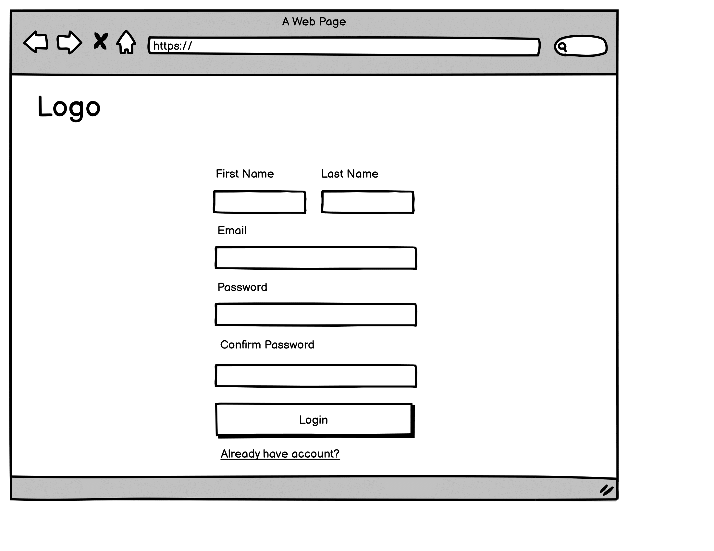
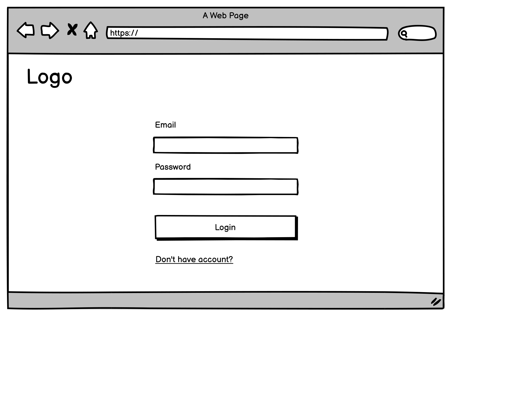
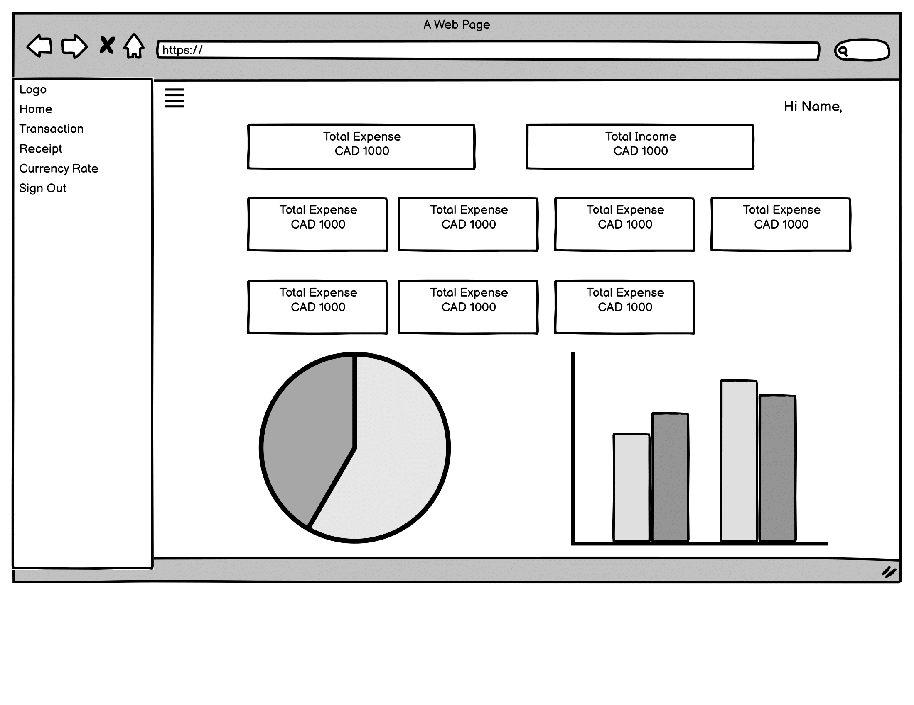
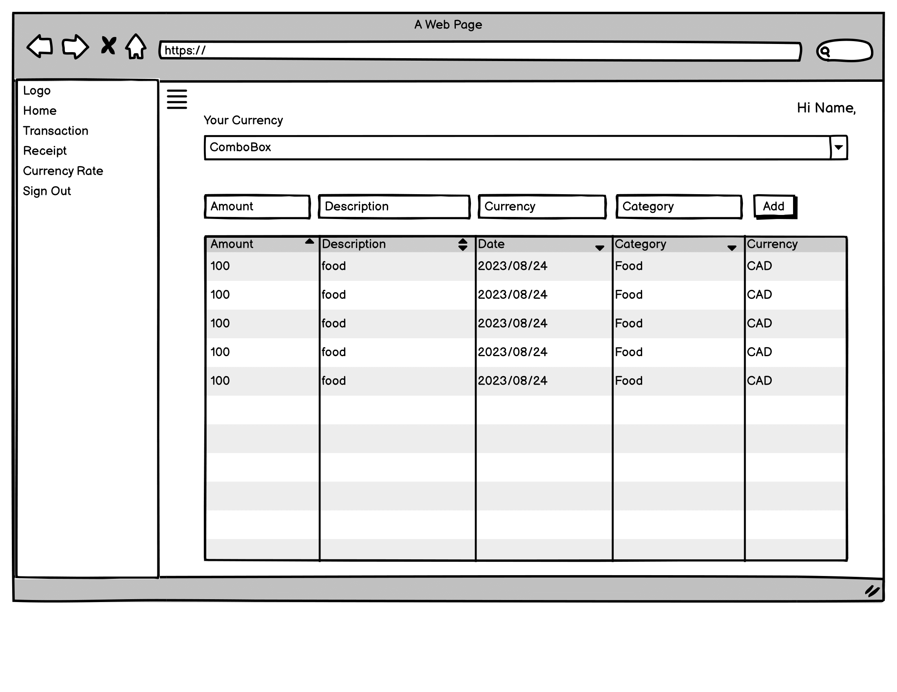
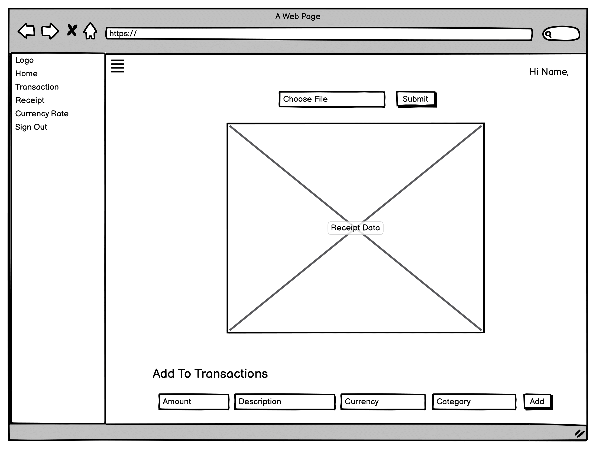
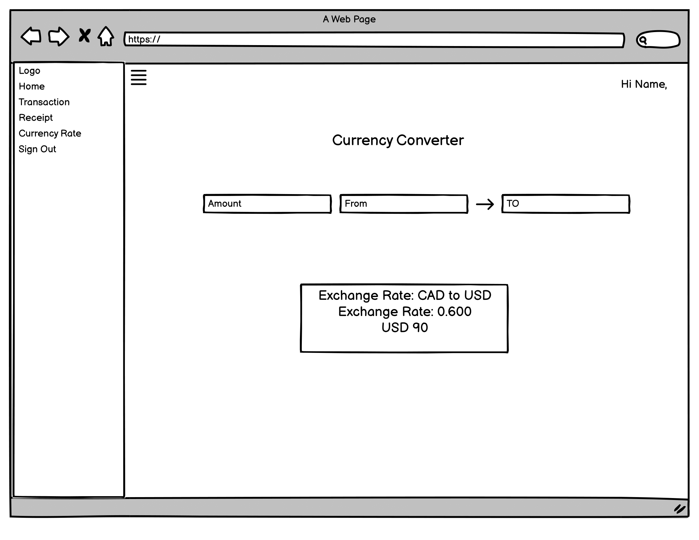
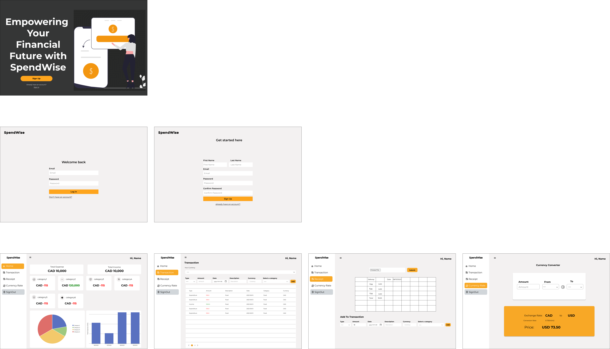

# Spend Wise

## About the Project

1. This app is about to keep record financial expense and income.
   The user can change currency, so that people in all over the world are able to use it.
   Moreover, they can check the currency rate through the app, which means when they are going to other countries (and use other currencies) they can easily keep recording with this app.
   Also, there is a feature of input data from the receipt.
   The user can see the summary of usage and input on their top page.

2. I'm not a person who keeps financial records, but one of my friends keeps records very strictly in her journal every month. She/He keeps all receipts every time. I think I can help her/him save time by creating a financial record app, as typing is much faster than writing. Additionally, the app can automatically generate summarized data, eliminating the need for manual calculations.

Furthermore, as an international student, incorporating a currency conversion feature into the financial record-keeping app is crucial. This feature would allow users who need to use their savings in their home country to easily track their expenditures by comparing them to their local currency.

## Strategy

### 3. Target

- People who comes from other countries (Business to Customers)

### 4. Questions for users

- What makes a good experience (shopping, watching, searching, etc)?

  - Summarizing the Reports for monthly financial usage

- What things would the user usually do first? Why?

  - Going to Transaction page, and adding the testing data because the users usually would like to know how it works and what features the app has.

- What would the user put off as long as they can? Why?

  - They sometimes prograstinate updating their financial record regularly. Because it takes some time, and they need to see how much they spent (which might be stressful for most of people who cares about the monthly budget)

- How often does or would the user use the product?

  - At least once a week since the user keep checking how much they have used and they can use in a month.

- What would or does the user use the product for most often?

  - The users can check the summarized data, so they will use the dashboard page most often to check their financial status

- If the user has an existing product that they use, how do they use it?

  - They might use this app for checking the currency conversion data

- What things or products are used before, during, or after using this product?

  - They are using bank apps to check transaction (especially credit card transaction) for gathering their transaction record before using this app, and after using this app and export their transaction data, they are keep it in thier computer or hard copying, and store it.

- How can the product compare to others the user has used before?
  - They can compare this app in terms of the ease of use. How much they are easily keep recording. Also, they can compare to others in terms of the accuracy, which means how much accurate the currency conversion rate is.

### 5. Goals

- The goal of this app is to create an application that caters to the needs of international users who wish to easily maintain their financial records.

### 6. List of features/opportunities

- Authentication and User Management
  - Implement a user authentication system to allow users to sign up, log in, and manage their accounts. This will enable users to have personalized expense tracking and secure access to their data.
- Expense Tracking
  - Allow users to track their expenses by categorizing them, adding tags, and recording the amount spent. Provide a user-friendly interface to input and view expenses.
- Income Tracking
  - Enable users to track their income sources and record the amount earned. This feature can help users analyze their cash flow and financial stability.
- Multi-Currency Support
  - Extend the automatic currency exchange feature to support multiple currencies. Allow users to select their preferred currency and automatically convert all expenses to their chosen currency. Display expenses in both the original currency and the user's preferred currency for better clarity.|
- Bill Management
  - Allow users to enter their recurring bills, such as rent, utilities, subscriptions, and loan payments. (If possible)Provide reminders and notifications to help users stay on top of their payment schedules and avoid late fees.|
- Budgeting
  - Allow users to set budgets for different categories such as groceries, utilities, entertainment, etc. (If possible)Provide alerts or notifications when users exceed their budget limits.|
- Financial Goal Setting & Tracking
  - Enable users to set and track financial goals, such as saving for a vacation, buying a car, or paying off debt. Users should be able to set target amounts, track progress, and receive reminders to stay focused on their goals. Provide progress tracking and reminders to help users stay on track.|
- Export and Report Generation
  - Allow users to export their expense data in common formats such as CSV or PDF. (If possible)Additionally, provide pre-defined or customizable report generation options that summarize their expenses based on different criteria (e.g., by category, by time period). This will enable users to analyze their expenses offline or share them with others if needed.|
- Financial Reports and Analytics
  - Generate reports and charts to give users an overview of their financial health. Include features like income vs. expenses, spending patterns, savings rate, net worth, etc.|
- Customization Options
  - Provide users with options to personalize their finance tracker, such as choosing themes, creating custom categories, and setting preferences based on their financial needs.|
- Multi-platform Access
  - Build a web-based application or mobile app to ensure users can access their finance tracker from different devices and platforms.|
- Receipt Scanning and OCR
  - Implement an optical character recognition (OCR) system that allows users to scan and extract information from their receipts automatically. This feature eliminates the need for manual data entry and improves accuracy.|
- Dark and Light Mode
  - Implement light mode and dark mode (User can change easily by click)

### 7. Budget

- time to research - 2/12
- time to work - 4/12
- time for debugging - 4/12
- time for finishing touches - 2/12

### 8. Opportunitties/features

- Importance
  - Transaction Data CRUD - (Rate: 5)
  - Sign In/ Out - (Rate: 5)
  - Dashboard (Show summary of transaction) - (Rate: 5)
  - Currency Rate Conversion - (Rate: 4)
  - Multi Platform Access - (Rate: 4)
- Feasibility
  - Transaction Data CRUD - (Rate: 5)
  - Sign In/ Out - (Rate: 5)
  - Dashboard (Show summary of transaction) - (Rate: 5)
  - Currency Rate Conversion - (Rate: 5)
  - Multi Platform Access - (Rate: 5)

### 9. Releases

**Release 1: Building the Foundation**

- Stage - Establishing the Core Framework
- User Value - Users will experience a streamlined interface for data input and basic categorization, simplifying their financial record-keeping process.
- Business Value - This release sets the foundation for the app, allowing for user testing and feedback to improve future releases. It introduces the app to the market.
- Features/Functions -
  - User-friendly data entry
  - Basic expense categorization

Points for this release: 2

**Release 2: Enhanced Functionality**

- Stage - Expanding User Capabilities
- User Value - Users will benefit from automated features like receipt scanning and categorized expense summaries, making record-keeping even more efficient.
- Business Value - This release enhances user satisfaction and attracts more users due to increased functionality.
- Features/Functions -
  - Receipt scanning and attachment
  - Automated expense categorization
  - Summary of categorized expenses

Points for this release: 4

**Release 3: Optimization and Reporting**

- Stage - Providing Insights and Data Visualization
- User Value - Users gain access to visual reports showcasing spending patterns and budget adherence, enabling better financial decision-making.
- Business Value - The app differentiates itself by offering advanced insights, increasing user loyalty and potentially attracting premium subscribers.
- Features/Functions -
  - Visual spending reports
  - Budget tracking and alerts
  - Enhanced data visualization

Points for this release: 6

Total points as per available resources: 12

## Scope

### 10. Scenarios

**Scenario 1: International Traveler's Expense Tracking**

Description: Sarah is an international business traveler who frequently incurs expenses in different currencies. She wants a solution that simplifies her expense tracking, especially when dealing with varying currencies.

**Scenario 2: Business Owner's Financial Insights**

Description: Alex is a small business owner who wants to gain a comprehensive overview of his business's financial health. He's looking for tools that provide detailed reports and analytics.

**Scenario 3: College Student's Budgeting Journey**

Description: Emily is a college student who wants to take control of her finances and learn how to budget effectively. She's searching for a user-friendly app that can guide her through the process.

### 11. Developing the above scenarios

**Scenario 1: International Traveler's Expense Tracking**
User Flow:

1. Sarah logs into the app using her account credentials.
2. She navigates to the "Multi-Currency Support" feature and selects her preferred currency from the list of supported options.
3. Throughout her travels, Sarah uses the "Expense Tracking" feature to record expenses. The app automatically converts expenses to her chosen currency based on the exchange rates.
4. As she records expenses, Sarah tags them with relevant categories for better organization.
5. When Sarah generates a report using the "Financial Reports and Analytics" feature, she can easily view her spending patterns and analyze her expenses, even when they're in different currencies.

Value to User: The app streamlines Sarah's expense tracking during her travels by automatically handling currency conversions and providing clear insights into her spending patterns. This saves her time and helps her make informed financial decisions.

Value to Business: The multi-currency support feature attracts users like Sarah who deal with international expenses. This enhances the app's appeal to a global audience and sets it apart from apps with limited currency functionality.

**Scenario 2: Business Owner's Financial Insights**

User Flow:

1. Alex logs into the app and accesses his account.
2. He enters his business income using the "Income Tracking" feature, recording the amounts earned from sales and services.
3. Alex also records his business expenses using the "Expense Tracking" feature, categorizing them into categories such as supplies, utilities, and marketing.
4. Alex generates financial reports using the "Financial Reports and Analytics" feature, which provides him with insights into income vs. expenses, spending trends, and net worth.
5. He also exports these reports in PDF format using the "Export and Report Generation" feature, allowing him to share them with his accountant for tax preparation.

Value to User: The app empowers Alex with detailed financial insights into his business, enabling him to make informed decisions, monitor his cash flow, and manage expenses effectively.

Value to Business: The financial reports and analytics feature caters to business owners like Alex who need a deeper understanding of their financial performance. This enhances the app's appeal to entrepreneurs and fosters user loyalty.

**Scenario 3: College Student's Budgeting Journey**

User Flow:

1. Emily signs up for an account.
2. She begins her budgeting journey. She allocates amounts for essentials like groceries, transportation, and textbooks.
3. Using the "Expense Tracking" feature, Emily records her daily expenses as she goes about her college life. She categorizes each expense and adds tags for better organization.
4. As Emily records her expenses over the semester, she generates periodic financial reports using the "Financial Reports and Analytics" feature.
5. Emily uses the insights from these reports to identify spending patterns, adjust her budget as needed, and plan for future expenses.

Value to User: The app provides Emily with a practical and educational tool to develop budgeting skills. It helps her track expenses, manage her budget, and make informed financial decisions during her college years.

Value to Business: This scenario highlights the app's appeal to young adults and students seeking to build strong financial habits. By providing value and guidance, the app can foster a user base of financially responsible individuals.

### 12&13. Communication of each scenarios

**Scenario 1: International Traveler's Expense Tracking**

**Scenario 2: Business Owner's Financial Insights**

**Scenario 3: College Student's Budgeting Journey**

## Structure

### 14.

- Type: Hierarchical
- Diagram:
  

### 15.

For the financial app, we will use a combination of organizing principles to ensure a user-friendly and efficient experience. These principles will revolve around the app's core functionalities and user needs. The primary organizing principles we will employ are "Audience" and "Functionality."

**Audience-Based Organization:**
Considering the diverse user base of my financial app, we will employ audience-based organization to cater to different user segments. My user authentication and management system will play a crucial role in this aspect. Users will sign up and log in to their personalized accounts, allowing them to access their individualized financial data securely. This approach will enable us to offer tailored experiences to various user groups, such as individual consumers, business owners, and students.

**Functionality-Based Organization:**
We recognize the importance of effective expense tracking and financial management. My app's core features, including expense tracking, income tracking, and multi-currency support, will be organized based on their functionality. Users will seamlessly input and categorize expenses, record income sources, and utilize the automatic currency exchange feature. This functional organization ensures that users can easily find and utilize the tools they need to manage their financial activities efficiently.

In summary, my financial app's information architecture will be organized primarily based on audience segments and core functionalities. This structure aims to provide users with a streamlined experience that caters to their individual needs while ensuring efficient financial management and analysis.

## Skeleton

### 16. Wireframe

a.

b.

- Is anything important missing?
  - The forms for Sign Up and Login pages are not clear - need to clearly describe what information is needed
  - Not clear what information is described on dashboard page
  - No Receipt scanning page
- Is the most important content noticed first?
  - Not really. Hard to find what the most important content through the draft. However, the transaction page, which might be one of the most important pages, is described clearly.
- Is there anything that shouldn’t be here? Which content is related and how?
  - In terms of the wireframe, the information of database table is not necessary. You can remove it.
- Can you get to all of the major areas from here?

  - No. This draft is missing receipt scanning page, and it's necessary to be added since the client is not able to how to look the receipt scanning page.

c & d.

- Welcome Page
  
- Sign UP Page
  
- Login Page
  
- Homepage (dashboard)
  
- Transaction Page
  
- Receipt Page
  
- Currency Rate Page
  

## Surface/UI

### 17.

In alignment with the goals and objectives outlined in my "business" plan, we have carefully selected design elements that resonate with my vision and enhance the user experience.

**Color Scheme: Orange**
My chosen color scheme of orange reflects my commitment to energy, enthusiasm, and vibrancy. Orange is a color that resonates with optimism and innovation, which perfectly aligns with my financial app's aim to empower users in their financial management journey. The warm and inviting nature of orange also instills a sense of trust and approachability, inviting users to engage with my app with confidence.

**Fonts: Montserrat (Sans-Serif)**
We have opted for the Montserrat font, a sleek and contemporary sans-serif typeface. This font choice complements my goal of creating an app that is modern, easy to read, and user-friendly. Montserrat's clean lines and versatile weights ensure that my app's content is presented legibly across different devices, maintaining a consistent and professional appearance.

**Design Decisions: Easiness of Use**
Central to my design philosophy is the principle of easiness of use. We have made conscious design decisions that prioritize intuitive navigation, clear visual hierarchy, and minimal clutter. My user interface is designed to guide users seamlessly through the app's features, ensuring that even individuals with varying levels of financial knowledge can navigate and interact comfortably.

The combination of the energetic orange color scheme, the readability and modernity of the Montserrat font, and the overarching focus on ease of use collectively contribute to an app design that resonates with my goals and objectives. My design elements not only reflect my brand identity but also enhance the overall user experience, fostering trust and engagement among my users.

### 18.

- Prototype
  https://www.figma.com/file/XNMe9P11SX6Ild6CR82MEd/Mock?type=design&node-id=6%3A427&mode=design&t=KKtwL13FAm3LiDHA-1

- Image
  

## ERD

### 19.

- Database plan:
  - Creating three tables: Categories, Users, Transactions
  - Transactions table is referenced by Categories and Users table
  - Users table is referenced by Categories table
  - Users table has first_name, last_name, email, and password_digest
  - Categories table has some default category names
  - Transaction table has amount, date, description, currency, and transaction_type(income or expense)

### 20 & 21 & 22.

